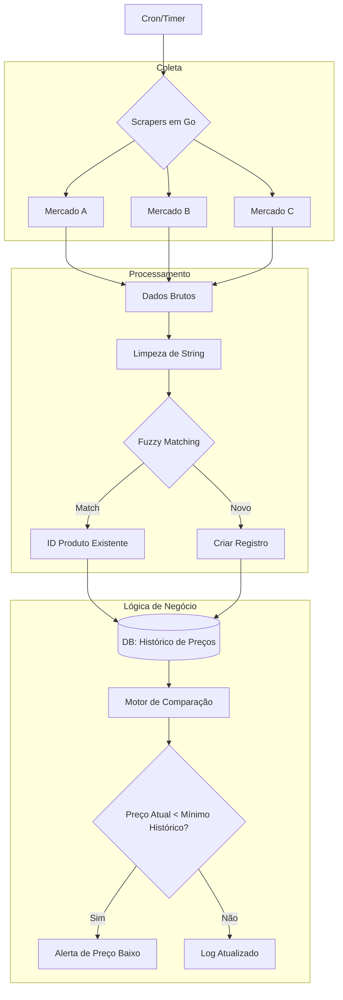

# Market Tracker

Projeto focado em monitorar preços de supermercados locais que disponibilizam dados públicos. A ideia é manter um log histórico para identificar o menor preço atual e comparar com a mínima histórica de cada produto.

O core do projeto é construído em Go, aproveitando a concorrência para realizar o scraping de múltiplos alvos simultaneamente sem perda de performance.

## Tech Stack
- Backend: Go (Goroutines para scrapers concorrentes)
- Scraping: Colly / Go-rod
- Dados: PostgreSQL ou SQLite
- Matching: Algoritmo de Levenshtein para normalização de strings

## Arquitetura e Fluxo

O sistema segue um fluxo de coleta, normalização e comparação:



## O Problema da Normalização
Como cada mercado escreve o nome do produto de um jeito (ex: "Arroz Tio João 5kg" vs "Arroz T. João 5kg"), o backend utiliza uma camada de Fuzzy Matching. Usamos a distância de Levenshtein para calcular a similaridade entre os nomes coletados e o que já temos no banco, garantindo que o histórico de preços seja confiável.

## Como rodar
1. Instalação:
   ```bash
   go mod tidy
   ```
2. Configuração:
   Configure as URLs dos mercados e as credenciais do banco no arquivo .env.
3. Execução:
   ```bash
   go run main.go
   ```

## Roadmap
- [ ] Implementar scrapers para os principais mercados.
- [ ] Criar interface simples para consulta do histórico.
- [ ] Adicionar notificações (Telegram/WhatsApp) para quedas de preço recordes.

---
Projeto pessoal focado em engenharia de dados e performance.